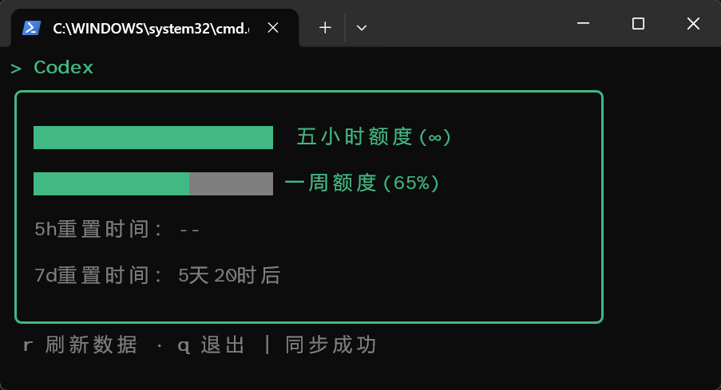

# codex-q

在终端查看 Codex 五小时额度和一周额度的 TUI 工具。

## 截图


## 使用

> 注意：Node.js 版本 ≥ 26.3.0，运行时需使用以下--experimental-ffi标志

```bash
npx @llds/codex-q
```

也可以全局安装：

```bash
npm install -g @llds/codex-q
codex-q
```

## 快捷键

| 按键 | 功能 |
| --- | --- |
| `Tab` / `Shift+Tab` | 切换额度、Token 统计、项目用量和模型用量页面 |
| `↑` / `↓` | 在项目用量页面翻页 |
| `r` | 刷新额度 |
| `q` | 退出程序 |
| `Ctrl+C` | 退出程序 |

## 数据来源

`codex-q` 读取 Codex 本地会话日志：

```text
~/.codex/sessions/**/rollout-*.jsonl
```

程序根据日志中的 `used_percent`、`window_minutes` 和 `resets_at` 计算
剩余额度与重置时间，也会汇总每个会话最新的 Token 快照，并按项目工作目录和模型展示用量，不需要 OpenAI API Key。


## 致谢

+ 额度读取方式参考 [CodexOrbit](https://github.com/xxll569/CodexOrbit)

+ [**LINUX DO 社区**](https://linux.do) (真诚 、友善 、团结 、专业)
