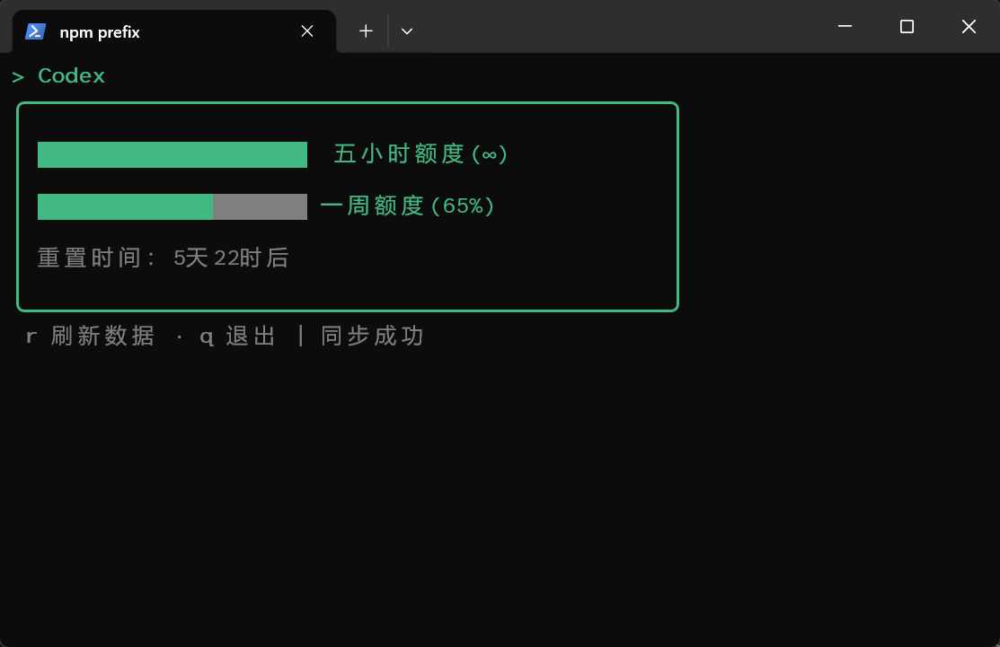

# codex-q

在终端查看 Codex 五小时额度和一周额度的 TUI 工具。

## 截图


## 使用

```bash
npx codex-q
```

也可以全局安装：

```bash
npm install -g codex-q
codex-q
```

## 快捷键

| 按键 | 功能 |
| --- | --- |
| `r` | 刷新额度 |
| `q` | 退出程序 |
| `Ctrl+C` | 退出程序 |

## 数据来源

`codex-q` 读取 Codex 本地会话日志：

```text
~/.codex/sessions/**/rollout-*.jsonl
```

程序根据日志中的 `used_percent`、`window_minutes` 和 `resets_at` 计算
剩余额度与重置时间，不需要 OpenAI API Key。


## 致谢

额度读取方式参考 [CodexOrbit](https://github.com/xxll569/CodexOrbit)